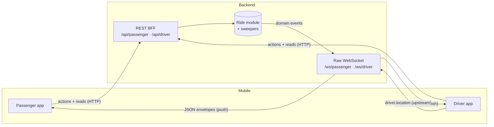
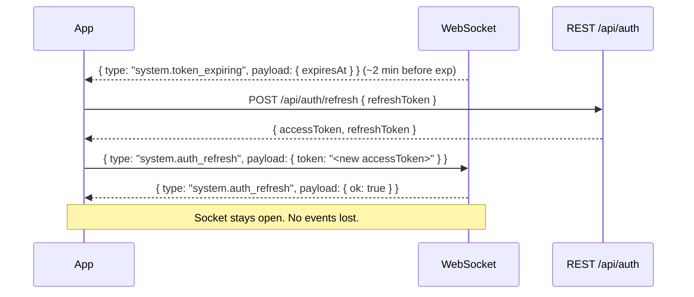
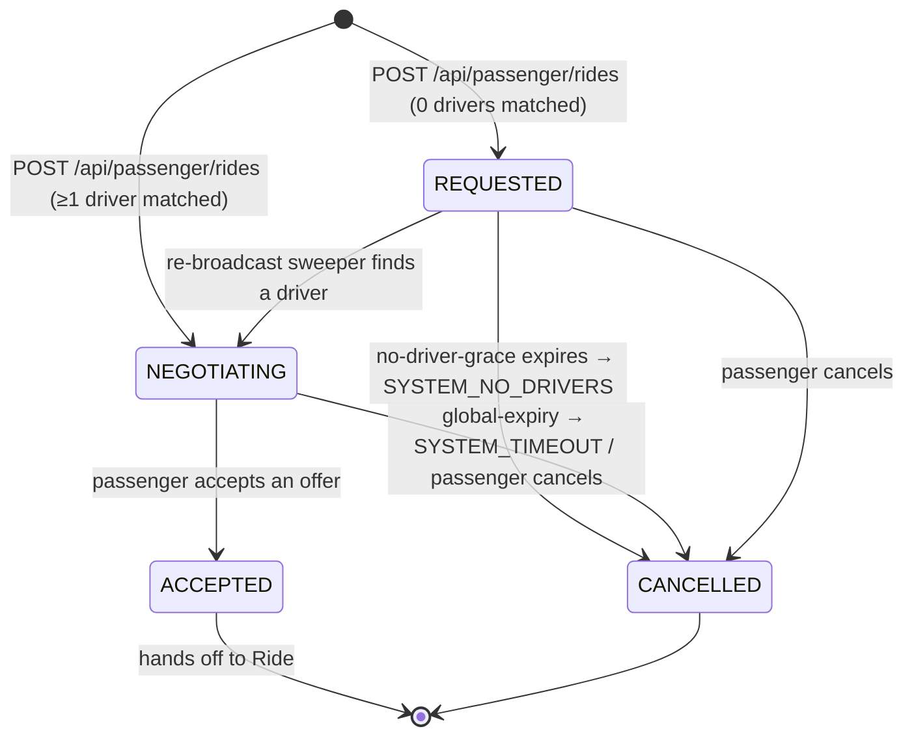
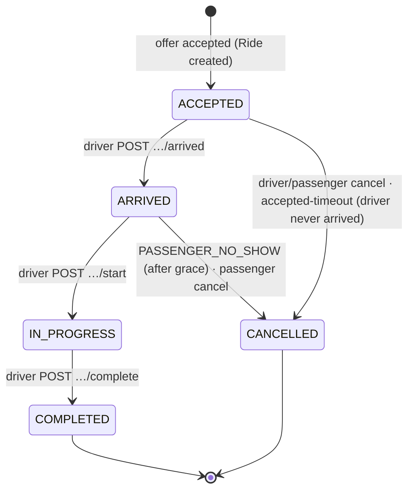
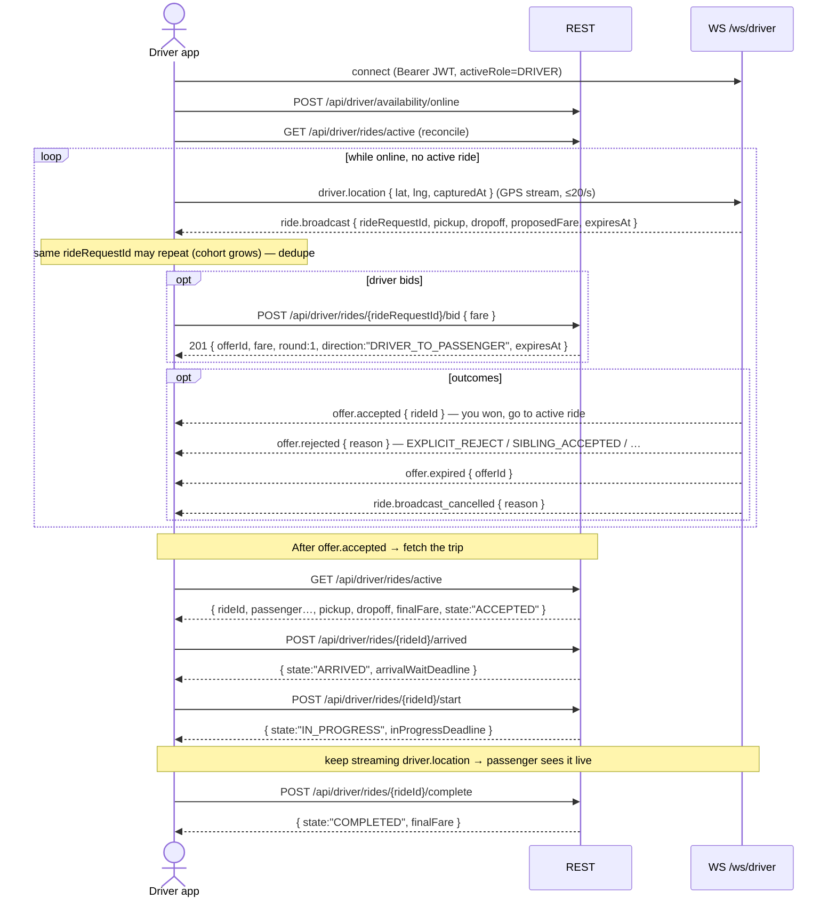

# Epic 03 — Ride: Mobile Integration Runbook

**Audience:** Flutter developers integrating the **passenger** and **driver** apps with the VTC ride backend.

**What this is:** the end-to-end *flow* — which REST call to make when, what arrives over the
WebSocket and in what order, the state machines, the server-side timers that change state on their
own, and how to recover. It is the glue Swagger can't show you.

**What this is NOT:** an exhaustive field reference. Swagger (`/swagger-ui.html`) and
`docs/api/passenger.md` / `docs/api/driver.md` are the field-level contract. When this doc shows a
payload it is illustrative; the live schema wins.

> ⚠️ **Read this first — transport is raw WebSocket, NOT STOMP.** There is no STOMP, no SockJS, no
> topic/destination subscriptions. Do **not** add a STOMP client library. You open one plain
> WebSocket per surface and receive a stream of JSON envelopes. See [§4](#4-websocket-protocol).

---

## 1. Conventions

| Thing | Rule |
|---|---|
| Money | Fares are **whole DZD integers** (e.g. `750` = 750 DZD). No minor units, no decimals. |
| Time | All timestamps are **ISO-8601 UTC** (e.g. `2026-06-13T10:30:00.000Z`). |
| IDs | All IDs are **UUID** strings. |
| Source of truth | **REST is authoritative state. WebSocket is best-effort push.** The socket can drop; the server buffers nothing. On (re)connect, refetch state from `GET /rides/active`, then let WS events drive incremental updates. |
| Auth | Every REST call and the WS handshake carry `Authorization: Bearer <accessToken>`. |
| Idempotency | Every mutating `POST` accepts an optional `Idempotency-Key: <uuid>` header (5-min Redis dedupe). Use it so retries are safe. |
| Tunable values | Every numeric threshold below is a **server-config default** (`vtc.admin.configuration.*`) and may change at runtime. Prefer the `expiresAt` / `*Deadline` fields in responses over hardcoding any number. |

---

## 2. Architecture at a glance



Two channels, one truth:

- **REST** — you *do* things (create request, bid, accept, cancel, arrived/start/complete) and you
  *read* snapshots (`/rides/active`, `/rides/{rideId}`, `/rides/{rideRequestId}/offers`).
- **WebSocket** — the server *tells* you when something changed (an offer came in, the ride was
  accepted, the driver moved, the request timed out). If the socket is offline, events are dropped —
  the server buffers nothing. Always reconcile against REST on reconnect.

---

## 3. Auth & tokens

Tokens come from the shared **`/api/auth`** surface (OTP request/verify, refresh, logout,
switch-role) — see `docs/api/auth.md`. This runbook assumes you already hold a valid mobile JWT.

| Claim | Value |
|---|---|
| `iss` | `vtc-app` |
| `aud` | `vtc-mobile` |
| `activeRole` | `PASSENGER` or `DRIVER` |

- Passenger and driver share the **same** issuer/audience; the surface is distinguished by
  `activeRole`, not by a different key.
- The `/ws/driver` handshake additionally **requires `activeRole == DRIVER`** — a passenger-scoped
  token is rejected with `401`.
- Access tokens live ~15 minutes. Long-lived screens (an active ride) must refresh **without**
  dropping the socket — see the token-refresh flow in [§4](#token-refresh-without-disconnect).
- A user who is both passenger and driver switches role via `/api/auth/switch-role`, which mints a
  token with the other `activeRole`. Connect the matching WS endpoint for the active role.

---

## 4. WebSocket protocol

### Endpoints

| Surface | Endpoint |
|---|---|
| Passenger | `/ws/passenger` |
| Driver | `/ws/driver` |
| Admin | — (none in v1; admin dashboard polls REST) |

There are **no sub-paths, query params, topics, or subscribe frames.** You connect to the one
endpoint for your role and receive every event routed to your `(surface, userId)`.

### Handshake authentication

Send the JWT in the **`Authorization` header of the upgrade request**:

```
GET /ws/passenger HTTP/1.1
Upgrade: websocket
Authorization: Bearer <accessToken>
```

The server validates the token *before* upgrading. Missing / expired / wrong-`iss`/`aud` (or wrong
`activeRole` for `/ws/driver`) → the handshake is rejected with HTTP **401** and no socket opens.

> **Flutter note:** custom handshake headers work on native mobile (`dart:io`). With
> `web_socket_channel`, use `IOWebSocketChannel.connect(uri, headers: {'Authorization': 'Bearer $token'})`.
> The browser `WebSocket` API (Flutter web) **cannot** set headers — not a concern for the iOS/Android
> apps, but don't reuse that code path on web without a query-token shim (not currently supported
> server-side).

### Message envelope

Every frame — both directions — is this JSON envelope:

```json
{
  "type": "offer.created",
  "payload": { "...": "event-specific" },
  "timestamp": "2026-06-13T10:30:00.000Z",
  "clientMessageId": "f1e2…"
}
```

| Field | Direction | Notes |
|---|---|---|
| `type` | both | Dot-namespaced event name (see [§5 catalog](#5-event-catalog)). |
| `payload` | both | Event-specific object. |
| `timestamp` | both | ISO-8601 UTC emit time. |
| `clientMessageId` | client→server only | Optional UUID for upstream idempotency (60-s per-connection dedupe window). |

### Token refresh without disconnect

Dropping the socket mid-ride is bad UX, so refresh in place:



If you miss the window and the token expires, the server closes with code **`4001`**; reconnect from
scratch with a fresh token.

### Heartbeat, reconnect & replay

- **Heartbeat:** the server sends a WS `ping` every ~30 s; your client library must answer with
  `pong` (most do automatically). After 2 missed pongs / one idle window, the server closes the
  socket.
- **Reconnect backoff:** 1s → 2s → 4s → 8s → 16s (cap).
- **Replay = refetch (the server buffers nothing).** On every (re)connect:
  - Passenger: `GET /api/passenger/rides/active`
  - Driver: `GET /api/driver/rides/active`

  Reconcile your UI to that snapshot, then resume applying live events. Missed events during the
  gap are recovered by the snapshot, not replayed.

### Rate limit & close codes

Upstream messages (driver GPS) are rate-limited to **20 msg/s** (`rate-limit.ws-msg-per-sec`).

| Close code | Meaning | Client should |
|---|---|---|
| `1000` | Normal closure | Do not auto-reconnect. |
| `4001` | Token expired (refresh missed) | Refresh via REST, reconnect. |
| `4002` | Rate limit exceeded | Back off, slow GPS cadence, reconnect. |
| `4003` | Authorization revoked (user blocked / role lost) | Force re-login. |
| `4004` | Server shutting down | Reconnect with backoff. |

---

## 5. Event catalog

All events arrive in the envelope; the tables below show the **`type`** and the **`payload`** shape.

### Passenger receives (server → passenger)

| `type` | `payload` | When |
|---|---|---|
| `ride.requested` | `{ rideRequestId, serviceType, femaleOnly, proposedFare }` | Echo confirming your request was accepted (no driver yet). |
| `ride.request_cancelled` | `{ rideRequestId, reason }` | Your **pre-acceptance** request was auto-cancelled by the system. `reason ∈ NO_DRIVERS \| TIMEOUT`. |
| `offer.created` | `{ offerId, rideRequestId, driverId, fare, direction, round, expiresAt }` | A driver bid on your request. |
| `offer.accepted` | `{ offerId, rideRequestId, rideId, driverId, fare }` | An offer was accepted; `rideId` is now set. |
| `offer.rejected` | `{ offerId, rideRequestId, reason }` | An offer ended without acceptance — see reason table below. |
| `offer.expired` | `{ offerId, rideRequestId }` | An offer hit its 30-s timeout. |
| `ride.state_changed` | `{ rideId, state, occurredAt }` | Ride moved: `state ∈ ACCEPTED \| ARRIVED \| IN_PROGRESS \| COMPLETED \| CANCELLED`. |
| `ride.cancelled` | `{ rideId, actorType, reason, occurredAt }` | Convenience event for a **post-acceptance** cancel (also reflected by `ride.state_changed → CANCELLED`). |
| `driver.location` | `{ rideId, driverId, lat, lng, capturedAt }` | Live driver position; **only after `ACCEPTED`**, throttled ~5 s; suppressed before acceptance and after `COMPLETED`/`CANCELLED`. |
| `system.token_expiring` | `{ expiresAt }` | ~2 min before JWT expiry. |
| `system.auth_refresh` | `{ ok: true }` | Ack of your upstream `system.auth_refresh`. |

### Driver receives (server → driver)

| `type` | `payload` | When |
|---|---|---|
| `ride.broadcast` | `{ rideRequestId, pickup{lat,lng,address}, dropoff{lat,lng,address}, proposedFare, femaleOnly, serviceType, vehicleCategory, expiresAt }` | A request matched you. **May arrive repeatedly for the same `rideRequestId`** as the re-broadcast sweeper adds you to a growing cohort — dedupe by `rideRequestId`. |
| `ride.broadcast_cancelled` | `{ rideRequestId, reason }` | A broadcast card is gone. `reason ∈ PASSENGER_CANCELLED \| TIMEOUT \| ALREADY_ACCEPTED \| SYSTEM_NO_DRIVERS`. Remove that card. |
| `offer.accepted` | `{ offerId, rideRequestId, rideId, fare }` | **The passenger accepted *your* bid** → you now have a ride. Navigate to the active-ride screen. |
| `offer.rejected` | `{ offerId, rideRequestId, reason }` | Your bid ended — see reason table below. |
| `offer.expired` | `{ offerId, rideRequestId }` | Your bid hit its 30-s timeout. |
| `ride.state_changed` | `{ rideId, state, occurredAt }` | Your active ride moved. |
| `ride.cancelled` | `{ rideId, actorType, reason, occurredAt }` | Your active ride was cancelled (by passenger / system / admin). |
| `system.token_expiring` | `{ expiresAt }` | ~2 min before JWT expiry. |

### Upstream (client → server)

| `type` | `payload` | Surface | Notes |
|---|---|---|---|
| `driver.location` | `{ lat, lng, capturedAt, accuracyM? }` | driver | GPS ingest — primary channel (REST `/api/driver/location` is the fallback). Throttled to 20/s. |
| `system.auth_refresh` | `{ token }` | both | Replace credentials mid-connection. |

> Sending any other `type`, or any upstream on the passenger socket beyond `system.auth_refresh`, may
> close the connection (policy violation). Passengers send nothing except the refresh message.

### Reason enums you must handle

**`offer.rejected.reason`:**

| Reason | Meaning (passenger view) | Meaning (driver view) |
|---|---|---|
| `EXPLICIT_REJECT` | You refused this offer. | The passenger refused your bid. |
| `SIBLING_ACCEPTED` | You accepted a different driver's bid → this one withdrawn. | The passenger picked another driver. |
| `REQUEST_CANCELLED` | The request was cancelled → offers withdrawn. | The request was cancelled. |
| `DRIVER_OCCUPIED` | This driver took a different ride → their bid to you is gone (clear the stale card). | — |
| `DRIVER_OFFLINE` | — | You toggled Work OFF; your active bids were auto-withdrawn. |

**`ride.broadcast_cancelled.reason`:** `PASSENGER_CANCELLED`, `TIMEOUT`, `ALREADY_ACCEPTED`
(someone else won), `SYSTEM_NO_DRIVERS`.

**`ride.cancelled.actorType`:** `PASSENGER`, `DRIVER`, `SYSTEM`, `ADMIN`.

> **Reserved / not emitted in v1:** `offer.countered`. The negotiation engine in Epic 03 is the
> simple MVP — drivers bid once, passengers accept or refuse; there are no counter-offers, no
> passenger→driver offers, and no auto-accept. The `offer.countered` type and the `round` /
> `previousOfferId` / `direction` fields exist for a future multi-round engine. Don't build UI for
> counter-offers yet; `direction` is always `DRIVER_TO_PASSENGER` and `round` is always `1`.

---

## 6. State machines

The backend splits the lifecycle into **two** entities. Track both.

### RideRequest (the negotiation phase — passenger-owned)



- `REQUESTED` = "searching" (you matched zero drivers yet). `broadcastDriverCount == 0`.
- `NEGOTIATING` = at least one driver was reached; offers may stream in.
- `ACCEPTED` = an offer won; a `Ride` now exists (`rideId`).
- `CANCELLED` = terminal (passenger or system).

### Ride (the trip phase — created on acceptance)



Each transition (who triggers it → what the **other** party sees):

| From → To | Triggered by | REST call | Other party receives |
|---|---|---|---|
| (create) → `ACCEPTED` | Passenger accepts | `POST /rides/{rideRequestId}/offers/{offerId}/accept` | Driver: `offer.accepted` + `ride.state_changed:ACCEPTED` |
| `ACCEPTED` → `ARRIVED` | Driver | `POST /rides/{rideId}/arrived` | Passenger: `ride.state_changed:ARRIVED` |
| `ARRIVED` → `IN_PROGRESS` | Driver | `POST /rides/{rideId}/start` | Passenger: `ride.state_changed:IN_PROGRESS` |
| `IN_PROGRESS` → `COMPLETED` | Driver | `POST /rides/{rideId}/complete` | Passenger: `ride.state_changed:COMPLETED` |
| any non-terminal → `CANCELLED` | Passenger / Driver / System / Admin | `POST .../cancel` (or sweeper) | Both: `ride.state_changed:CANCELLED` + `ride.cancelled` |

### Offer (per bid)

`ACTIVE → ACCEPTED | REJECTED | EXPIRED | WITHDRAWN`. Only `ACTIVE` offers are acceptable/refusable.
`GET /rides/{rideRequestId}/offers` returns them sorted **cheapest-first, ties by ETA**.

---

## 7. Timing windows (server-driven state changes)

The server changes state on its own via 1-second sweepers. Your UI must anticipate these — **read the
deadline/`expiresAt` fields from responses and count down to them; do not hardcode the defaults.**

| Window | Config key | Default | Client-visible field | What happens at the edge |
|---|---|---|---|---|
| No-driver "searching" grace | `negotiation.no-driver-grace-s` | 60 s | `request.expiresAt` (when `REQUESTED`) | Request → `CANCELLED:SYSTEM_NO_DRIVERS`; passenger gets `ride.request_cancelled:NO_DRIVERS`. |
| Negotiation global expiry | `negotiation.global-expiry-s` | 300 s | `request.expiresAt` (when `NEGOTIATING`) | Request → `CANCELLED:SYSTEM_TIMEOUT`; passenger gets `ride.request_cancelled:TIMEOUT`. |
| Driver offer timeout | `negotiation.driver-response-timeout-s` | 30 s | `offer.expiresAt` | Offer → `EXPIRED`; both sides get `offer.expired`. |
| Re-broadcast cadence | `matching.rebroadcast-interval` (ISO-8601 duration) | `PT10S` (10 s) | — | New eligible drivers get a fresh `ride.broadcast` (delta only). |
| Driver-must-arrive timeout | `ride.accepted-timeout-s` | 120 s | — | `ACCEPTED` ride with no arrival → `CANCELLED:SYSTEM_TIMEOUT`. |
| No-show grace (after ARRIVED) | `ride.arrival-wait-s` | 300 s | `ride.arrivalWaitDeadline` | Before deadline, driver cancel as `PASSENGER_NO_SHOW` → `ARRIVAL_GRACE_NOT_ELAPSED`. After, allowed. |
| In-progress cap | `ride.in-progress-cap-h` | 6 h | `ride.inProgressDeadline` | Admin alert only (no auto-cancel). |
| Post-cancel cooldown | `ride.cancellation-cooldown-s` | 30 s | — | New `POST /rides` → `429 RIDE_CREATE_COOLDOWN` until elapsed. |
| Driver-location throttle | `location.tracking-broadcast-min-interval-s` | 5 s | — | Passenger gets at most one `driver.location` per interval. |

Other negotiation knobs: max **3** concurrent active bids per driver
(`negotiation.max-concurrent-bids-per-driver`); broadcast radius **10 km**
(`matching.broadcast-radius-km`).

**Fare bounds** (whole DZD): passenger proposes ≥ **150** (`fare.min-proposed-fare-dzd`). A driver's
bid must fall in `[max(100, proposed×(1−band)), min(50000, proposed×(1+band))]` where band = **±50 %**
(`fare.counter-band-percent`); floor `100`, ceiling `50000`. Out of range → `400 FARE_OUT_OF_BOUNDS`
(error `details` carry the min/max).

---

## 8. End-to-end: passenger flow

```mermaid
sequenceDiagram
    actor P as Passenger app
    participant R as REST
    participant W as WS /ws/passenger

    Note over P,W: Connect WS first, then refetch snapshot
    P->>W: connect (Bearer JWT)
    P->>R: GET /api/passenger/rides/active  (cold-start reconcile)

    P->>R: POST /api/passenger/rides { pickup, dropoff, serviceType, vehicleCategory, femaleOnly, proposedFare }
    R-->>P: 201 { rideRequestId, state, proposedFare, expiresAt, broadcastDriverCount }

    alt state == REQUESTED (0 drivers, "searching")
        Note over P,W: show searching spinner until request.expiresAt
        opt a driver appears within grace
            W-->>P: (request flips to NEGOTIATING — offers begin)
        end
        opt grace expires with nobody
            W-->>P: ride.request_cancelled { reason: "NO_DRIVERS" }
            Note over P: suggest widening filters / retry
        end
    else state == NEGOTIATING (≥1 driver)
        Note over P: show "negotiating" / live offer list
    end

    loop offers stream in
        W-->>P: offer.created { offerId, driverId, fare, expiresAt }
        opt periodic / on tap
            P->>R: GET /api/passenger/rides/{rideRequestId}/offers
            R-->>P: { offers:[…] }  (cheapest-first)
        end
        opt offer times out
            W-->>P: offer.expired { offerId }
        end
        opt passenger refuses one
            P->>R: POST /rides/{rideRequestId}/offers/{offerId}/refuse
        end
    end

    P->>R: POST /rides/{rideRequestId}/offers/{offerId}/accept
    alt won the race
        R-->>P: 200 { rideId, state: "ACCEPTED", finalFare }
        W-->>P: offer.accepted { rideId } · ride.state_changed { ACCEPTED }
    else lost the SETNX race
        R-->>P: 409 RIDE_ALREADY_ACCEPTED
        Note over P: refetch /rides/active; another offer already won
    end

    W-->>P: driver.location { lat, lng }  (every ~5 s, until completion)
    W-->>P: ride.state_changed { ARRIVED }
    W-->>P: ride.state_changed { IN_PROGRESS }
    W-->>P: ride.state_changed { COMPLETED }
```

Passenger edge cases to code for:

- **Searching vs negotiating** is driven by `state` + `broadcastDriverCount` on the create response,
  then by WS. Don't assume drivers exist just because the request was created.
- **Accept is racy.** Multiple offers can be tapped near-simultaneously; the server uses a Redis lock.
  Treat `409 RIDE_ALREADY_ACCEPTED` / `OFFER_NOT_ACTIVE` as "refetch and re-render", not a hard error.
- **Cancel** via `POST /rides/{rideRequestId}/cancel { reason: "PASSENGER_CHANGED_MIND", note? }`,
  allowed through `ARRIVED` but **not** `IN_PROGRESS`. After a cancel you're in a cooldown
  (`429 RIDE_CREATE_COOLDOWN` on the next create until it elapses).

---

## 9. End-to-end: driver flow



Driver edge cases to code for:

- **Re-broadcast duplicates:** you may receive `ride.broadcast` for the same `rideRequestId` more than
  once (the sweeper re-emits to newly-eligible drivers). Key your available-list by `rideRequestId`
  and upsert.
- **Bid bounds:** keep the fare in band (see [§7](#7-timing-windows-server-driven-state-changes)); a
  bad value returns `400 FARE_OUT_OF_BOUNDS` with the allowed min/max in `details`. Max **3** active
  bids at once (`409 MAX_BIDS_REACHED`).
- **You must be online & free:** bidding while offline → `409 DRIVER_OFFLINE`; bidding with an active
  ride → `409 DRIVER_HAS_ACTIVE_RIDE`. Going offline auto-withdraws your active bids
  (passenger/driver get `offer.rejected:DRIVER_OFFLINE`).
- **Stale cards:** when a request is no longer biddable you get `ride.broadcast_cancelled` or, after
  you've bid, `offer.rejected` — remove the card either way. A bid on a closed request returns
  `409 RIDE_REQUEST_NOT_NEGOTIATING`.

---

## 10. Cancellation & timeout matrix

Reason enum required; free-text `note` optional. No money moves in Epic 03.

| Ride state | Passenger may cancel | Driver may cancel | System (sweeper) | Admin |
|---|---|---|---|---|
| `REQUESTED` | ✓ `PASSENGER_CHANGED_MIND` | ✗ | `SYSTEM_NO_DRIVERS` at grace | ✓ |
| `NEGOTIATING` | ✓ `PASSENGER_CHANGED_MIND` | ✗ | `SYSTEM_TIMEOUT` at global-expiry | ✓ |
| `ACCEPTED` | ✓ | ✓ `DRIVER_TOO_FAR` / `DRIVER_VEHICLE_ISSUE` | `SYSTEM_TIMEOUT` if driver never arrives | ✓ |
| `ARRIVED` | ✓ | ✓ `PASSENGER_NO_SHOW` (only after `arrival-wait-s`; else `ARRIVAL_GRACE_NOT_ELAPSED`) | — | ✓ |
| `IN_PROGRESS` | ✗ | ✗ | — | ✓ `ADMIN_FORCED` |

Who gets told:

- **Pre-acceptance** cancel/timeout → passenger: `ride.request_cancelled` (`NO_DRIVERS`/`TIMEOUT`);
  cohort drivers: `ride.broadcast_cancelled`.
- **Post-acceptance** cancel → both passenger and driver: `ride.state_changed:CANCELLED` +
  `ride.cancelled { actorType, reason }`.
- Endpoints: passenger `POST /api/passenger/rides/{rideRequestId}/cancel`; driver
  `POST /api/driver/rides/{rideId}/cancel`.

---

## 11. Driver location streaming

- **Primary channel:** the driver app streams GPS as WS upstream `driver.location`
  `{ lat, lng, capturedAt, accuracyM? }`. **Fallback:** REST `POST /api/driver/location` (same shape)
  for when the socket is down. Both share the 20/s rate limit.
- **Passenger consumption:** the passenger receives `driver.location { rideId, driverId, lat, lng,
  capturedAt }`, throttled to ~5 s.
- **Privacy windows:** the passenger only receives positions **after `ACCEPTED`** and **before**
  `COMPLETED`/`CANCELLED`. Before acceptance (during negotiation) and after the trip ends, no position
  is sent — don't show a driver marker outside that window.
- Keep streaming through `IN_PROGRESS`; stop when the ride reaches a terminal state.

---

## 12. Error handling & recovery

All errors share the envelope `{ "error": { "code", "message", "details?" } }`. Ride-relevant codes:

| Code | HTTP | When | Client should |
|---|---|---|---|
| `VALIDATION_ERROR` | 400 | Bad field(s) | Read `details` (field → message). |
| `FARE_OUT_OF_BOUNDS` | 400 | Fare outside bounds | Show min/max from `details`; re-prompt. |
| `SERVICE_TYPE_VEHICLE_MISMATCH` | 400 | `VAN` not paired with `DELIVERY` | Fix selection inline. |
| `INVALID_CANCELLATION_REASON` | 400 | Reason illegal for actor/state | Show the valid reason set. |
| `FEMALE_ONLY_NOT_PERMITTED` | 403 | Non-female passenger set `femaleOnly` | Hide the toggle for non-female passengers. |
| `RIDE_NOT_FOUND` / `RIDE_REQUEST_NOT_FOUND` | 404 | Unknown / not yours | Refetch list. |
| `OFFER_NOT_FOUND` | 404 | Unknown offer | Refresh offers. |
| `RIDE_ALREADY_ACTIVE` | 409 | Passenger already has a live request/ride | Route to the existing ride; block new create. |
| `RIDE_REQUEST_NOT_NEGOTIATING` | 409 | Bid/accept on a closed request | Drop the card; refetch available/offers. |
| `RIDE_ALREADY_ACCEPTED` | 409 | Lost the accept race | Refetch `/rides/active`; another offer won. |
| `OFFER_NOT_ACTIVE` | 409 | Offer already resolved | Refresh offers. |
| `INVALID_STATE_TRANSITION` | 409 | UI state is stale | Refetch ride; re-render from server state. |
| `ARRIVAL_GRACE_NOT_ELAPSED` | 409 | No-show before grace | Show countdown to `arrivalWaitDeadline`; retry after. |
| `MAX_BIDS_REACHED` | 409 | Driver at 3 active bids | Wait for one to resolve. |
| `DRIVER_OFFLINE` | 409 | Bid/accept against an offline driver | Driver: go online. Passenger: pick another offer. |
| `DRIVER_HAS_ACTIVE_RIDE` | 409 | Driver already on a ride | Route to active-ride screen. |
| `RIDE_CREATE_COOLDOWN` | 429 | New request during post-cancel cooldown | Show countdown, then allow. |
| `UNAUTHORIZED` | 401 | Missing/expired token | Refresh or force re-login. |

General rule: **409s usually mean "your view is stale" — refetch the relevant snapshot and re-render,
don't surface a scary error.** Use `Idempotency-Key` on POSTs so a retried request (e.g. after a
network blip on accept) doesn't double-act.

---

## 13. Client implementation checklist

- [ ] **REST is truth, WS is hints.** On connect/reconnect, call `GET /rides/active` and reconcile;
      then apply live events incrementally.
- [ ] **Connect WS with the `Authorization` header**; on `system.token_expiring`, refresh + send
      `system.auth_refresh` to keep the socket alive; handle close `4001` by reconnecting fresh.
- [ ] **Implement reconnect backoff** (1/2/4/8/16 s) and answer pings.
- [ ] **Dedupe by id:** offers by `offerId`, broadcasts/available by `rideRequestId`, rides by
      `rideId`. Re-broadcasts and multi-device sessions both produce duplicate-looking events.
- [ ] **Drive UI from `state`**, not from optimistic local guesses; trust `ride.state_changed`.
- [ ] **Count down to server fields** (`expiresAt`, `arrivalWaitDeadline`, `inProgressDeadline`), not
      hardcoded seconds.
- [ ] **Treat 409s as refetch triggers**, not failures (especially accept/bid races).
- [ ] **Passenger:** only render the driver marker between `ACCEPTED` and terminal state.
- [ ] **Driver:** stream `driver.location` upstream; fall back to REST `/location` if the socket drops.
- [ ] **Wave-2 / nullable fields:** `etaSeconds`, `distanceMeters`, `durationSeconds`,
      `routeGeometryGeoJson` may be `null` (ETA needs the Maps adapter; distance/duration/route are
      back-filled asynchronously after `complete`). Render gracefully when absent.
- [ ] **Don't build counter-offer UI** — `offer.countered` is reserved; `round` is always `1` and
      `direction` is always `DRIVER_TO_PASSENGER` in this epic.

---

## 14. Reference pointers

| Need | Where |
|---|---|
| Field-level REST contracts (live) | `/swagger-ui.html` |
| Passenger REST + WS event tables | `docs/api/passenger.md` |
| Driver REST + WS event tables | `docs/api/driver.md` |
| WebSocket protocol (envelope, auth, refresh, close codes) | `docs/api/websocket.md` |
| Full error-code catalog | `docs/07-error-codes.md` |
| Negotiation / matching / cancellation mechanics | `docs/03-core-system-mechanics.md` |
| Authoritative ride state machines | `docs/modules/04-ride.md` |
| Env-var / config defaults | `docs/08-environment-config.md` |
