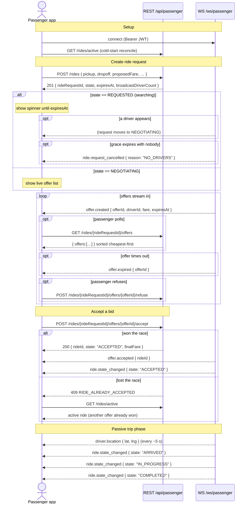

# Passenger Ride Flow — After a Driver Bids

**Audience:** Flutter developers building the passenger app.  
**Sources:** `websocket.json`, `passenger.json`, `epic-03-ride.md`, `driver-flow.md`

---

## 1. Architecture Overview

Two channels, one source of truth:

| Channel | Purpose |
|---|---|
| **REST** `/api/passenger/*` | Actions (create, accept, refuse, cancel) and state snapshots |
| **WebSocket** `/ws/passenger` | Server push — offers, state changes, driver location |

**REST is authoritative. WebSocket is best-effort push.** On any reconnect, refetch `GET /api/passenger/rides/active` and reconcile UI before applying live events.

---

## 2. Pre-requisites (Before the Bid Arrives)

```
1. Connect WebSocket:  GET /ws/passenger
   Header: Authorization: Bearer <accessToken>   (activeRole=PASSENGER)

2. Cold-start reconcile:
   GET /api/passenger/rides/active
   → if a ride/request already exists, restore UI from that snapshot

3. Create a ride request:
   POST /api/passenger/rides
   Body: { pickup, dropoff, serviceType, vehicleCategory, femaleOnly, proposedFare }
   → 201 { rideRequestId, state, proposedFare, expiresAt, broadcastDriverCount }
```

`state` on the create response tells you where you are:

| `state` | `broadcastDriverCount` | Meaning |
|---|---|---|
| `REQUESTED` | `0` | No drivers matched yet — show searching spinner |
| `NEGOTIATING` | `≥ 1` | At least one driver reached — offers may stream in |

---

## 3. Receiving a Driver Bid

When a driver bids, the server pushes `offer.created` to your WebSocket:

```json
{
  "type": "offer.created",
  "payload": {
    "offerId": "<uuid>",
    "rideRequestId": "<uuid>",
    "driverId": "<uuid>",
    "fare": 750,
    "direction": "DRIVER_TO_PASSENGER",
    "round": 1,
    "expiresAt": "2026-06-25T10:30:30Z"
  },
  "timestamp": "2026-06-25T10:30:00Z"
}
```

> Multiple `offer.created` events may arrive — different drivers bidding. Each offer expires in **30 seconds**. When an offer times out, `offer.expired { offerId, rideRequestId }` arrives.

---

## 4. Viewing Offers (Optional REST Poll)

On tap or periodically, fetch the sorted offer list:

```
GET /api/passenger/rides/{rideRequestId}/offers
→ { offers: [...] }   // sorted cheapest-first, ties broken by ETA
```

You can also drive the UI purely from WS events without polling.

---

## 5. Refusing an Offer

```
POST /api/passenger/rides/{rideRequestId}/offers/{offerId}/refuse
→ 200
```

The driver receives `offer.rejected { reason: "EXPLICIT_REJECT" }` and the offer is removed from your list.

---

## 6. Accepting an Offer

```
POST /api/passenger/rides/{rideRequestId}/offers/{offerId}/accept
```

**Two possible outcomes:**

| Outcome | HTTP | What to do |
|---|---|---|
| **Won the race** | `200 { rideId, state: "ACCEPTED", finalFare }` | Transition to the active-ride screen |
| **Lost the race** | `409 RIDE_ALREADY_ACCEPTED` | Call `GET /rides/active` — another offer already won; re-render from that |

> Use `Idempotency-Key: <uuid>` on this POST so network-blip retries don't double-accept.

On success, the server also:
- Rejects all other pending offers with `offer.rejected { reason: "SIBLING_ACCEPTED" }`
- Creates a `Ride` entity with the given `rideId`

---

## 7. Post-Accept WebSocket Confirmations

Both events arrive on your socket immediately after a successful accept:

```json
{ "type": "offer.accepted",   "payload": { "offerId", "rideRequestId", "rideId", "driverId", "fare" } }
{ "type": "ride.state_changed","payload": { "rideId", "state": "ACCEPTED", "occurredAt" } }
```

---

## 8. Post-Acceptance Passive Flow

The passenger makes **no further REST calls** during the trip. All transitions are driven by driver actions and pushed via WebSocket.

### Driver Location Streaming

Starts as soon as the ride enters `ACCEPTED` state:

```json
{
  "type": "driver.location",
  "payload": { "rideId", "driverId", "lat", "lng", "capturedAt" }
}
```

- Delivered every **~5 seconds** (server-throttled)
- **Only between `ACCEPTED` and terminal state** (`COMPLETED` / `CANCELLED`)
- Do **not** render the driver marker outside that window

### Ride State Changes

| Driver calls | Passenger receives |
|---|---|
| `POST /api/driver/rides/{rideId}/arrived` | `ride.state_changed { state: "ARRIVED" }` |
| `POST /api/driver/rides/{rideId}/start` | `ride.state_changed { state: "IN_PROGRESS" }` |
| `POST /api/driver/rides/{rideId}/complete` | `ride.state_changed { state: "COMPLETED" }` |

---

## 9. Full Sequence Diagram



---

## 10. Cancellation Rules

```
POST /api/passenger/rides/{rideRequestId}/cancel
Body: { "reason": "PASSENGER_CHANGED_MIND", "note": "optional free text" }
```

| Ride state | Passenger can cancel? |
|---|---|
| `REQUESTED` | ✓ |
| `NEGOTIATING` | ✓ |
| `ACCEPTED` | ✓ |
| `ARRIVED` | ✓ |
| `IN_PROGRESS` | ✗ (blocked) |

After cancel:
- Both passenger and driver receive `ride.state_changed { state: "CANCELLED" }` + `ride.cancelled { actorType, reason }`
- A **30-second cooldown** applies — `POST /rides` returns `429 RIDE_CREATE_COOLDOWN` until elapsed

---

## 11. Timing Windows

Read deadlines from **server response fields**, not hardcoded values — these are configurable at runtime.

| Window | Default | Server field | What happens at the edge |
|---|---|---|---|
| Offer expiry | 30 s | `offer.expiresAt` | `offer.expired` on both sides |
| No-driver searching grace | 60 s | `request.expiresAt` | `ride.request_cancelled { reason: "NO_DRIVERS" }` |
| Negotiation global expiry | 300 s | `request.expiresAt` | `ride.request_cancelled { reason: "TIMEOUT" }` |
| Driver-must-arrive timeout | 120 s | — | Ride auto-cancelled by system |
| No-show grace (after ARRIVED) | 300 s | `ride.arrivalWaitDeadline` | Driver may cancel as `PASSENGER_NO_SHOW` |
| Post-cancel cooldown | 30 s | — | `429 RIDE_CREATE_COOLDOWN` on next create |

---

## 12. Key Error Codes

**409s almost always mean "your view is stale" — refetch and re-render, don't show a scary error.**

| Code | HTTP | When | Client action |
|---|---|---|---|
| `RIDE_ALREADY_ACTIVE` | 409 | Creating a ride while one is already live | Route to existing ride |
| `RIDE_ALREADY_ACCEPTED` | 409 | Lost the accept race | `GET /rides/active`; re-render |
| `OFFER_NOT_ACTIVE` | 409 | Offer already resolved (expired/rejected) | Refresh offer list |
| `RIDE_REQUEST_NOT_NEGOTIATING` | 409 | Accept/refuse on a closed request | Drop card; refetch |
| `INVALID_STATE_TRANSITION` | 409 | UI state is stale | Refetch ride; re-render |
| `RIDE_CREATE_COOLDOWN` | 429 | New request during post-cancel cooldown | Show countdown, retry after |
| `FARE_OUT_OF_BOUNDS` | 400 | Proposed fare outside allowed range (min 150 DZD) | Show min/max from `details` |
| `FEMALE_ONLY_NOT_PERMITTED` | 403 | Non-female passenger set `femaleOnly: true` | Hide the toggle |
| `UNAUTHORIZED` | 401 | Missing/expired token | Refresh token or re-login |

---

## 13. Implementation Checklist

- [ ] Connect WS with `Authorization` header; on `system.token_expiring` → refresh + send `system.auth_refresh` upstream
- [ ] On connect/reconnect, call `GET /rides/active` and reconcile UI before applying live events
- [ ] Implement reconnect backoff: 1 s → 2 s → 4 s → 8 s → 16 s (cap); answer pings
- [ ] Dedupe offers by `offerId`; upsert, don't append
- [ ] Drive UI from `state` in `ride.state_changed`, not from optimistic local state
- [ ] Count down to `offer.expiresAt` and `request.expiresAt` from server fields — don't hardcode durations
- [ ] Handle `409 RIDE_ALREADY_ACCEPTED` as a refetch trigger, not a failure
- [ ] Render driver marker **only between `ACCEPTED` and terminal state**
- [ ] Cancel is allowed through `ARRIVED`; block the cancel button during `IN_PROGRESS`
- [ ] Show post-cancel cooldown countdown before allowing a new ride creation
